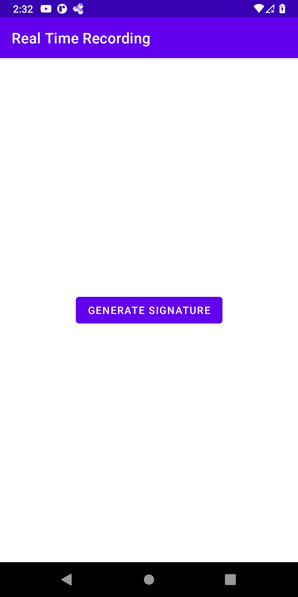
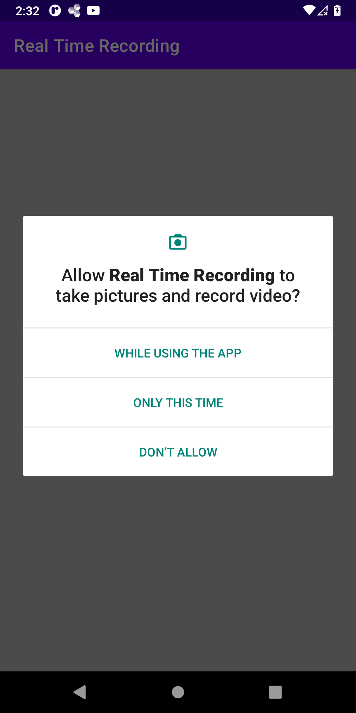
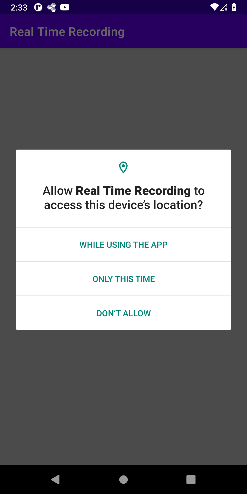
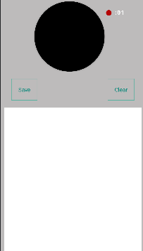

# Real-Time-Recording
Android project with OpenCV, Camera X Api for User Authentication.   
The app will start recording the screen containing the face of the user while he is drawing the signature.   
When the user clicks on the Save button video recording will be saved and you can share the generated video.

# Technologies Used
<ul>
  <li>Navigation Component: To navigate between fragments</li>
  <li>Koin: For Dependency Injection</li>
  <li>Permission Manager: Manage Camera and Location Permission while using the app</li>
  <li>Android Lifecycle: Performing threading operation with lifecycle awareness </li>
  <li>Location Tracking: Track user location and add the longitude and latitude coordinates to the video generated</li>
  <li>Kotlin Coroutines: Library for executing multi-thread operations </li>
  <li>FFMPEG: OpenCV library for generating video and manipulating frames </li>
  <li>Camera X: Jetpack Library to use the camera of Android phone for recording video </li>
</ul>  

# Screenshots 
<h2>1. Start Page</h2> 

<h2>2. Permission Handler</h2> 

When the Screen recorder page starts, the app will check that all required permissions are granted

<h3>2.1 Camera Permission Request</h3>

<h3>2.2 Location Permission Request</h3>

<h2>3. Screen Recorder</h2> 

<ol>
  <li>Get the current location of the user</li>
  <li>Initialize camera </li>
  <li>Display signature tab</li>
  <li>Record the signature tab and the user face </li>
  <li>Merge the 2 frames and add the date, uuid, and (longitude latitude) into one frame </li>
  <li>Assynchronisly repeat steps 4 & 5 every n seconds (Depending on the frame per second setup of the video)</li>
  <li>Pressing the Save button will generate the video </li>
  <li>Share the generated video</li>
</ol> 

# Frame Generation

You can change the frame per second by modifying the variable "FRAME_PER_SECOND" property in the VideoRecorder.kt class.   
The app will automatically calculate how many times frames should be generated per second based on the FRAME_PER_SECOND property

